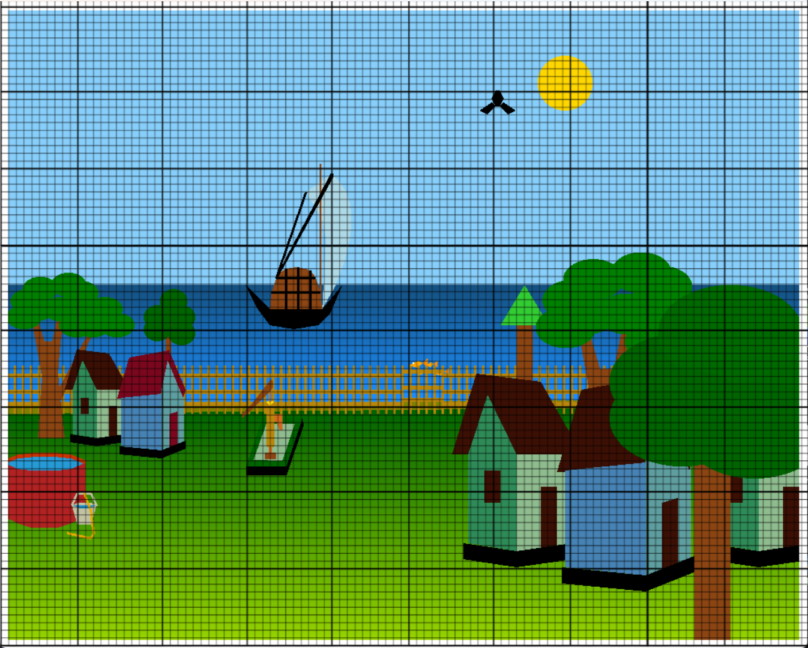
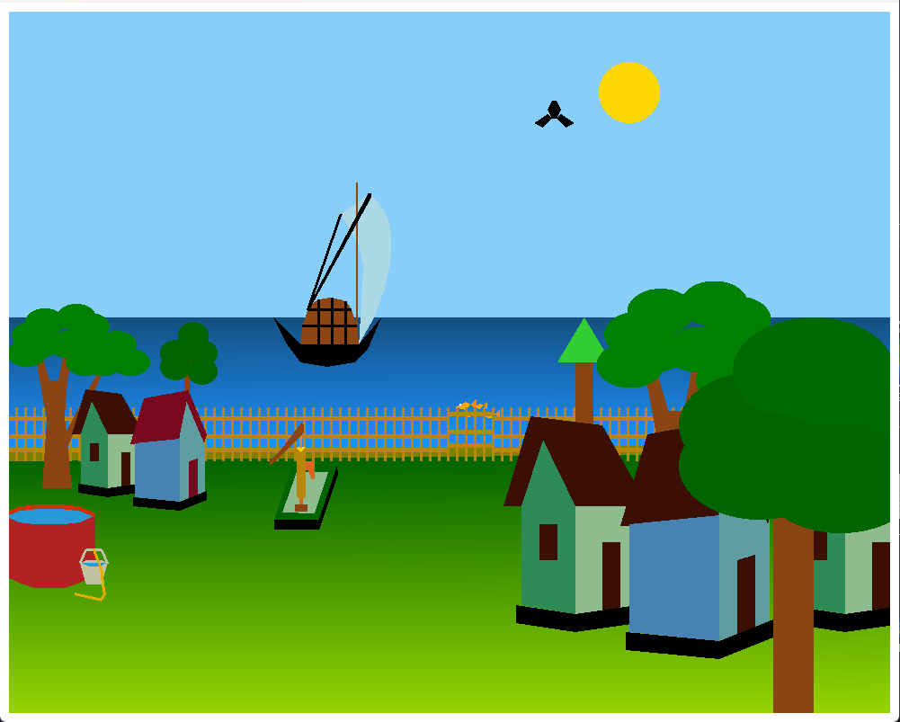
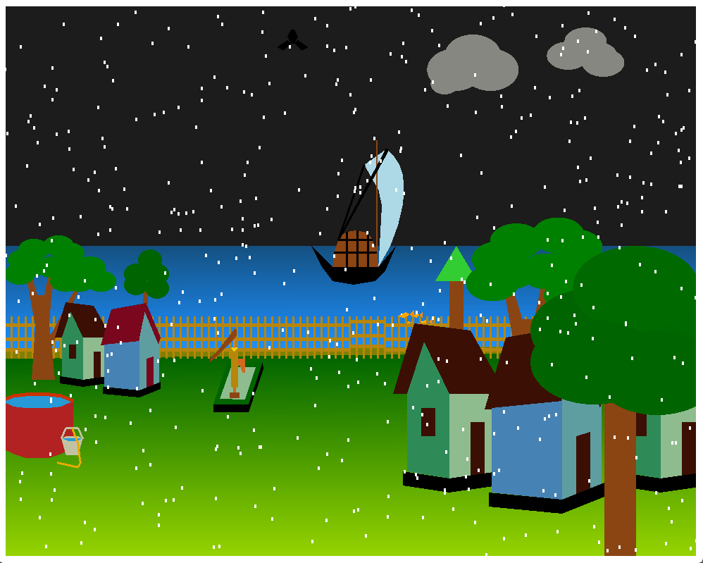
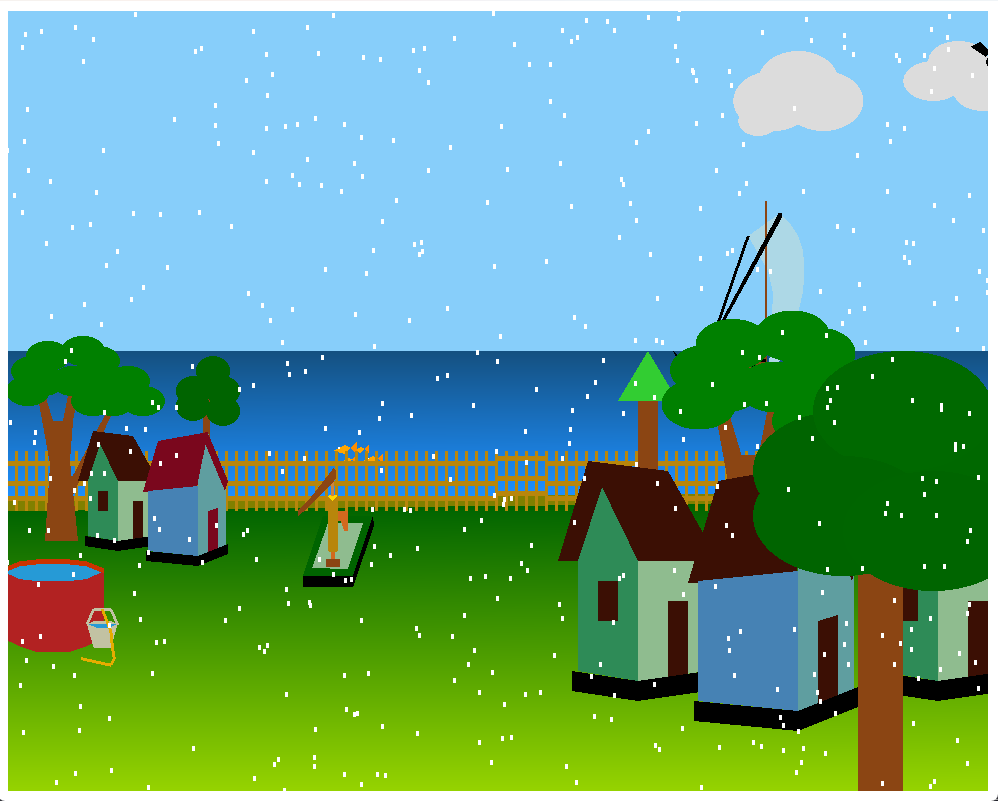
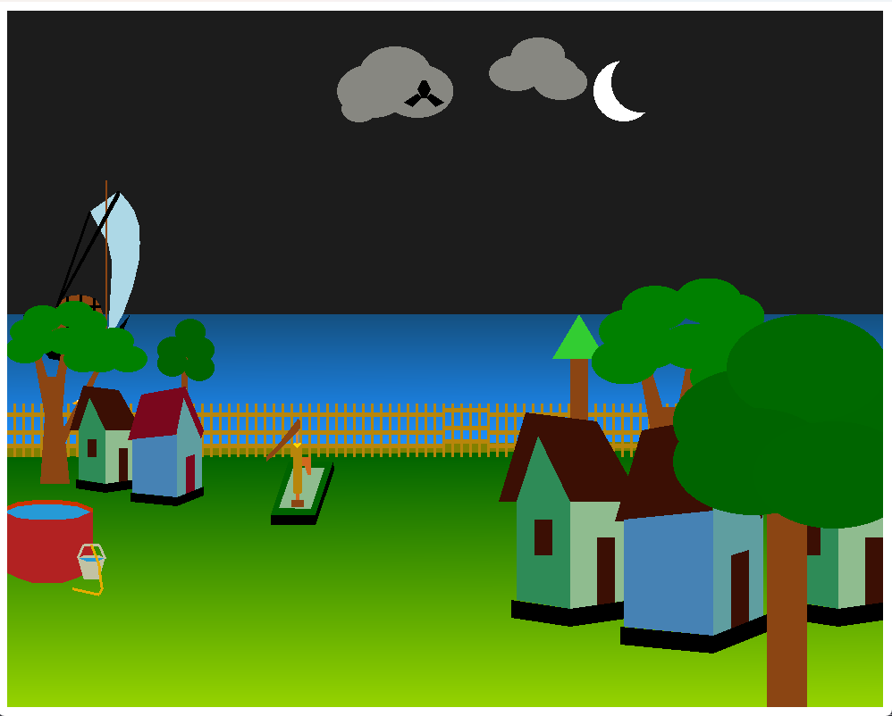

# OpenGL - Village Scenario Project

## 📱 Screenshot of our village

	

		
 	

 	

		 
 		 
 	

 	

		
 		 
	

## 💬 Connect with Me

## ⬇️ How to run

 - 🔭 Check this tutorial [Install and Run OpenGL in 5 minutes](https://github.com/zamansheikh/OpenGLWithVsCodeWin-Linux) | GuideLine for Linux and Windows 

## Keyboard Shortcuts

- Press `d` to toggle between day and night modes.
- Press `Escape` to exit the application.

## 🔔 Promotions

- 🔭 I’m currently working on [Campus Saga](https://github.com/zamansheikh/Campus-Saga) | Flutter Project

- 👯 I’m looking to collaborate on [Calcu](https://github.com/zamansheikh/Calcu) | This is my complete project. 

## 📖 Features

- Day and night mode
- Rain mode
- Raining when only sun is not visible or in night mode

## ⬇️ Graph Map

For furthur use, calculate the graph x'=0 to x 420 and y'=0 y=530. Window size is 2x for better view. 

## 💬 Contact

Join our [Telegram Channel](https://t.me/decodersfamily) for discussion, announcements, and releases!

## 💖 Sponsors

  --No sponsors
OpenGL Village will be always free and open source for everyone. If you like it, please consider [sponsoring me](https://github.com/sponsors/zamansheikh)!

## 💲Donate 

  

## 🤝 Contributing

Contributions are welcome!

	
>**Note**

>For submitting bug reports, feature requests, questions, or any other ideas to improve, please read [CONTRIBUTING.md](https://github.com/zamansheikh/openGL_village/blob/main/CONTRIBUTING.md) for instructions and guidelines first.

## 🧱 Credits

FreeIcon for Object, Computer Graphics course for Basic. 3D art studio for drawing. 

## 📃 License

>**Warning**

>Except for the source code licensed under the GPLv3 license,
>all other parties are prohibited from using OpenGL myVillage's name as a downloader app,
>and the same is true for OpenGL myVillage's derivatives.
>Derivatives include but are not limited to forks and unofficial builds.

<table><td>
<a href="#start-of-content">👆 Scroll to top</a>
</td></table>

